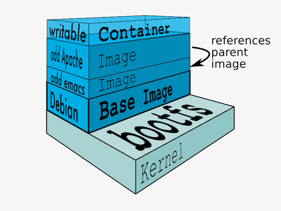

layout: true
count: false

---
class: middle, center

# Docker Deep Dive, Part One
## Understanding Images

_Michael Irwin - December 14, 2016_


---


## What problem is Docker addressing?

<div class="pull-right">
  
</div>

- Creating apps that can run anywhere is difficult
  - Environment differences
  - Dependency differences
  - Conflicts with other apps
- Onboarding new developers is costly
  - Takes a lot of time installing environment
  - Dev environments are often not documented (or up-to-date)
  - Isolation between app environments is tricky

---

## Not the first time this problem's existed...


---

## Just throw it in a container!


---

class: middle, center, inverse

> "We create the tools behind the scenes to make things happen.
> We're passionate about making tools.
> We build tools of mass innovation."

\- Solomon Hykes, Co-Founder and CTO of Docker


---

## What are the tools? Build. Ship. Run.

<div class="center">
  
</div>

---

class: middle, center, inverse

> "Containers are not VMs. Docker is not a virtualization technology, it’s an application delivery technology."

\- Mike Coleman, Sr. Technical Envangelist at Docker


---

## VMs vs Containers

<div class="center">
  
</div>


---
background-image: url(images/divingBoard.jpg)
background-size: 120%
background-position: center center

class: center, middle, full-screen-image

# Time to jump in!

---
class: center, middle, inverse

# What's an image again?
Anyone remember?


---


## Images are...


<div style="float:right;">
  
</div>

- Collection of filesystem changes organized into "layers"
  - Contains ONLY file changes, not running state
  - Doesn't keep track of what processes you had running
- Each layer references its parent and contains its changes
- Each layer is read-only and, therefore, immutable


---

## An actual image...

<div class="center">
  
</div>

---

## Dockerfile


<div class="pull-right">
  
</div>

```dockerfile
FROM alpine:latest

COPY cli-version /

RUN \
	mkdir -p /aws && \
	apk -Uuv add groff jq less python py-pip && \
	pip install awscli==$(cat /cli-version) && \
	apk --purge -v del py-pip && \
	rm /var/cache/apk/*

WORKDIR /aws
```

- Each command in the `Dockerfile` corresponds with a layer in the image


???
- The layer with hash `baa5d63471ea` is our `alpine` base


---

## Seeing an image's layers (history)

```bash
docker history mikesir87/aws-cli
```


--

```bash
docker history alpine
```


???
- Note that the order of the layers is opposite of that from the previous slide
  - Most recent is at top, with its parent on the next line

---
class: center, middle

# So... where does this image go?

--
A registry... duh!

---


## What's a registry?

<div class="pull-right">
  
</div>

- Simply a place to store images!
- Has a standardized REST API around it
  - There's two versions... V1 and V2
  - As expected, V2 is current version (as of Docker ~1.6)
- Default registry is found at https://registry.docker.io/
- Many other registries exist, including ECR, GitLab, Sonatype Nexus, etc.
  - Can even run your own using the `registry` image (from Docker Hub)


---

## Pushing an Image


---

## Pulling an Image

```bash
docker pull mikesir87/aws-cli
```

--

### What's going on?

1. Fetches image manifest at tag (if no tag is specified, uses `latest`)
2. For each layer that's not downloaded, fetch it


---

## Image Manifest

```bash
GET /v2/<image-name>/manifests/<tag>
```

```json
{
   "schemaVersion": 1,
   "name": "aws-cli",
   "tag": "latest",
   "architecture": "amd64",
   "fsLayers": [
      { "blobSum": "sha256:a3ed95caeb02ffe68cdd9fd84406680ae93d633cb16422d00e8a7c22955b46d4" },
      { "blobSum": "sha256:a5cc40516c60d5738c0dfe323677825d245a80edb6a751399a02ea6b88369a72" },
      { "blobSum": "sha256:9fa3e769ec114c6a0cd01a725fee47f0d482d35cc643e4d80492cf60ca471590" },
      { "blobSum": "sha256:3690ec4760f95690944da86dc4496148a63d85c9e3100669a318110092f6862f" }
   ],
   ...
}
```

???
The Docker client will look at each of the `blobSum`s and determine which blogs have not been fetched yet.

---

## Manifest - Layer History

```json
   "history": [
      {
         "v1Compatibility": "{\"architecture\":\"amd64\",\"config\":{\"Hostname\":\"1d811a9194c4\",\"Domainname\":\"\",\"User\":\"\",\"AttachStdin
\":false,\"AttachStdout\":false,\"AttachStderr\":false,\"Tty\":false,\"OpenStdin\":false,\"StdinOnce\":false,\"Env\":[\"PATH=/usr/local/sbin:/usr/
local/bin:/usr/sbin:/usr/bin:/sbin:/bin\"],\"Cmd\":null,\"ArgsEscaped\":true,\"Image\":\"sha256:efeeb7961edb9a2479611f0340ccaa824cca38ed2542889a3c
de858f8287678e\",\"Volumes\":null,\"WorkingDir\":\"/aws\",\"Entrypoint\":null,\"OnBuild\":[],\"Labels\":{}},\"container\":\"233c27f21cb4b344079583
05f2c4aa55dfa1ba85f844ee4865e90958358a0f5f\",\"container_config\":{\"Hostname\":\"1d811a9194c4\",\"Domainname\":\"\",\"User\":\"\",\"AttachStdin\"
:false,\"AttachStdout\":false,\"AttachStderr\":false,\"Tty\":false,\"OpenStdin\":false,\"StdinOnce\":false,\"Env\":[\"PATH=/usr/local/sbin:/usr/lo
cal/bin:/usr/sbin:/usr/bin:/sbin:/bin\"],\"Cmd\":[\"/bin/sh\",\"-c\",\"#(nop) \",\"WORKDIR /aws\"],\"ArgsEscaped\":true,\"Image\":\"sha256:efeeb79
61edb9a2479611f0340ccaa824cca38ed2542889a3cde858f8287678e\",\"Volumes\":null,\"WorkingDir\":\"/aws\",\"Entrypoint\":null,\"OnBuild\":[],\"Labels\"
:{}},\"created\":\"2016-12-13T04:49:16.461134488Z\",\"docker_version\":\"1.12.3\",\"id\":\"7571677e3d42720cfc39b2823a62eadb90bbe8bcc9cbb1f3026c7a42d2104812\",\"os\":\"linux\",\"parent\":\"527639ab97485271314381f8841f1b0724aa89eab5d9f37d14cb03d938eb159d\",\"throwaway\":true}"
      },
      {
         "v1Compatibility": "{\"id\":\"527639ab97485271314381f8841f1b0724aa89eab5d9f37d14cb03d938eb159d\",\"parent\":\"2e
         f2ead2ef1cd54286222ec1829724a1d38aa696995eba261eb5e4b185f01a6f\",\"created\":\"2016-12-13T04:49:15.707543931Z\",
         \"container_config\":{\"Cmd\":[\"/bin/sh -c mkdir -p /aws \\u0026\\u0026 \\tapk -Uuv add groff jq less python 
         py-pip \\u0026\\u0026 \\tpip install awscli==$(cat /cli-version) \\u0026\\u0026 \\tapk --purge -v del py-pip 
         \\u0026\\u0026 \\trm /var/cache/apk/*\"]}}"
      },
      {
         "v1Compatibility": "{\"id\":\"2ef2ead2ef1cd54286222ec1829724a1d38aa696995eba261eb5e4b185f01a6f\",\"parent\":\"4b5
         9778f82f9d17a484a278bd23d2d0b3c7ddcf022ab5250cf4f59308b3bc3f5\",\"created\":\"2016-12-13T04:48:54.211871825Z\",
         \"container_config\":{\"Cmd\":[\"/bin/sh -c #(nop) COPY file:81d0d047826fe805139af418fd23c1dead99cafb8fee198218a
         67d03636d5cf7 in / \"]}}"
      },
      {
         "v1Compatibility": "{\"id\":\"4b59778f82f9d17a484a278bd23d2d0b3c7ddcf022ab5250cf4f59308b3bc3f5\",\"created\":\"
         2016-10-18T20:31:22.321427771Z\",\"container_config\":{\"Cmd\":[\"/bin/sh -c #(nop) ADD file:7afbc23fda8b0b38726
         23c16af8e3490b2cee951aed14b3794389c2f946cc8c7 in / \"]}}"
      }
   ],
```

???
- First layer contains all the "what's needed to run this image" metadata.  Like... path, default command, working directory, etc.
- Sets the parent version between layers.
- Not really sure why there's a difference in IDs/sha's between the history and what's in the fsLayers collection

---

## Manifest - Signatures

```json
   "signatures": [
      {
         "header": {
            "jwk": {
               "crv": "P-256",
               "kid": "Q6FY:RG6F:CXGE:V5V7:3RQN:CMGD:ZSAX:4WMR:TOC4:HOBK:NA3P:5YA2",
               "kty": "EC",
               "x": "KzcHjvNLfCahys-uVGX8WJ6uoIwc2AnO5oO94SAnGUA",
               "y": "e7UJDlQsBQF0EKFMtdVd6vOFmjVkQxgB7Z4A1hatUPU"
            },
            "alg": "ES256"
         },
         "signature": "aT8O9XaLF4_BdgyNxt9nzdeltYh1KPMfbIqdhPli0JCmEP_S5qDWpqT1gyiUy2Cu7kONPtM3fL9jku_ytADH9w",
         "protected": "eyJmb3JtYXRMZW5ndGgiOjMyNDksImZvcm1hdFRhaWwiOiJDbjAiLCJ0aW1lIjoiMjAxNi0xMi0xNFQwMzoyNTowNloifQ"
      }
   ]
```

- With V2, signatures can be detached, rather than embedded within the manifest

---

## Downloading Blobs

```bash
GET /v2/<image-name>/blobs/<digest>
```

Example: `/v2/aws-cli/blogs/sha256:a3ed95caeb02ffe68cdd9fd84406680ae93d633cb16422d00e8a7c22955b46d4`

Response is simply a tar containing the contents of that layer. That's really it!


---

## "Empty" layers

- `Dockerfile` commands that change no files (`CMD`, `EXPOSE`, `VOLUMES`, etc.) have an empty tar
- Will automatically be ignored when running the container
- Still downloads them to keep track of what's been downloaded


---

## Non-empty Layers

- As expected, layers with filesystem changes have lots of files in them!
- Deleted files are marked with a `.wh.` prefix
  - Example - if `file.txt` was removed, the layer would have an empty `.wh.file.txt` file


---

background-image: url(images/forkInTheRoad.jpg)
background-size: 120%
background-position: center center

class: middle, full-screen-image

# FORK IN THE ROAD!!
### Let's apply some of this...

---

## How can we make this build faster and better?

```dockerfile
CMD "bash"
COPY ./src /app
RUN apt-get update && apt-get install -y nodejs && npm install
```

**Hint:** Think about what's most likely to change most often...

(In case you don't know anything about Node, there's a `package.json` file that lists all dependencies to install during `npm install`. We're assuming that's found at `/src/package.json`)

???
In this case, the thing

---

## Tip #1: Take advantage of Docker build cache

```dockerfile
RUN apt-get update && apt-get install -y nodejs
COPY ./src/package.json /app/package.json
RUN npm install
COPY ./src /app
CMD "sh"
```

- When Docker builds, it checks to see if a layer with that parent and command exists already
  - If so, it uses the cached version. If not, it'll build a new image layer
  - Once a new image is built, all subsequent steps have to be re-built due to the new parent
- **Pro tip:** Move commands/files that will change often to end of `Dockerfile` to increase cache hits
  - Decreases build times quite dramatically
  - Reduces the number of layers needed to be pushed/pulled

---

## Tip #1 Graphically...

- Example below shows a change `Dockerfile` with only last instruction changed
- Note how all parent images are still the same
  - Means when it's time to pull the `new` tag, we only have to pull the last layer


---

## What's wrong with this `Dockerfile`?

<div class="pull-right">
  
</div>

```dockerfile
RUN apt-get update && \
    apt-get install -y vim curl
RUN rm -rf /var/lib/apt/lists/*
```

--

- First `RUN` command contains the apt cache
- Second `RUN` removes the cache (lots of `.wh.` files)
- Final image doesn't need the cache, so why pay to push and then pull it all?

---

## Tip #2: Remove no longer needed files as you go

<div class="pull-right">
  
</div>

```dockerfile
RUN apt-get update && \
    apt-get install -y vim curl && \
    rm -rf /var/lib/apt/lists/*
```

Layer now has only the things we installed... no package management cache now!

---
background-image: url(images/breakTime.jpg)
background-size: 100%
background-position: center center

class: center, middle, full-screen-image
