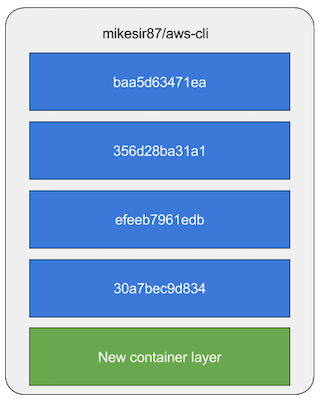
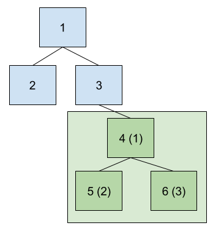
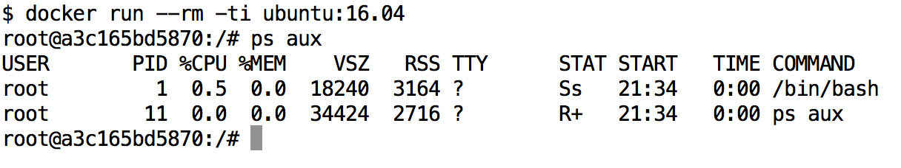

layout: true
count: false

---
class: middle, center

# Docker Deep Dive, Part Two
## Container Runtimes

_Michael Irwin - December 14, 2016_

---
class: middle, center, inverse

# What's a container again?
### How's it different than an image?

---

## Containers are...

- Simply an image with its own writeable layer
- Remember that image layers are immutable. New changes go into the containers layer

  
  
  

---
background-image: url(images/puzzled.jpg)
background-size: 110%
background-position: center center
class: middle right full-screen-image

# How's it _actually_ work?

---

## Image layers are "unioned" together

- Each image layer is mounted read-only, with only the top layer mounted as writable
- Uses COW (Copy-On-Write) to keep things efficient
- Default implementation is `AUFS`, but work is being done to swap that to `overlay2`

---
class: center middle inverse

# So, how's it look like a VM's isolation?

---

## Uses the power of namespaces

- Provides kernel-level isolation of processes
- Was released in July 2008 with Linux 2.6.26
- Number of namespaces has increased over the years
- Think of it like `chroot`, but for other aspects of the operating system

---

## Process namespace isolation

- Breaks "traditional" view of a single process tree
- Introduces the ability to have "nested" process trees, with each tree being isolated
- Prevents processes in one tree from affecting (and even knowing about) processes in other trees

---

## Container process isolation

- When a container is started, it gets its own process tree
- The default command is run as the root (PID 1)
- When PID 1 exits, the tree dies and the container is done

---

## Network namespace isolation

- Allows each process to see a completely different set of networking interfaces
  - Even the loopback interface is different for each namespace
- Each namespace gets virtual interfaces
- To make it work, a "routing process" has to route global network traffic to the correct interface

---

## Mount namespace

- Isolates metadata about mounted disk partitions, where they're mounted, what's read-only, etc.
- Gives the feel that each namespace has its own root

---

## User namespace

- Gives isolation of users and groups
- Allows users in one namespace to be completely isolated from another namespace
  - Reason why `root` in a container doesn't mean `root` on the host

---
class: middle center inverse

## Important: Still sharing same kernel (and resources)!

---

## House vs Apartment

- Isolated vs Shared Infrastructure

---

## Using cgroups

- Cgroups (Control Groups) provide resource controls
- Allows for soft and hard limits of CPU and RAM
- Does come with some overhead to keep up with the statistics
- Prevents one container from consuming all resources on the host, DOS'ing other containers

---
class: middle center inverse

# Thanks! Questions?