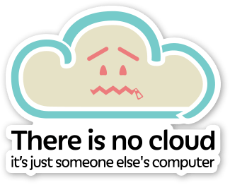

layout: true
count: false

---
class: middle, center

# Amazon ECS Overview
## EC2 Container Service

_Michael Irwin - January 11, 2017_

---

## What is AWS?

  

- Subsidiary of Amazon that offers cloud computing services
  - Provides machines (EC2), storage (S3, EBS, EFS), networking (VPC, Route53), databases, and more!
- Geographically distributed into 16 "regions"
  - Each region contains at least two availability zones (42 total)
- Making lots of money... $3.23 billion revenue during Q3 2016
  - Means lots going back into it ($2.21 billion in operating expenses)

---
class: center, middle

---

## What is ECS?

  <iframe width="896" height="504" src="https://www.youtube.com/embed/zBqjh61QcB4" frameborder="0" allowfullscreen></iframe>

---

## Key Takeaways

- ECS is Amazon's Docker container management service
- Integrates with load balancers, scaling groups, IAM, CloudWatch, etc.
- AWS console provides a dashboard to see metrics (CPU, RAM) across the cluster
- Free to use... you only pay for actual resources (EC2 machines)

---

## ECS Terminology

- **Cluster** - a grouping of compute resources (EC2s) that tasks will run on
- **Task** - a job of one or more containers that will execute
  - A Task Definition defines the task and its constraints (CPU, memory, etc.)
  - Can be assigned an IAM role
- **Service** - a scheduler that ensures desired state of tasks for a cluster
  - Interacts with load balancers and auto scaling groups

--

## Terms simplified...

- Tasks = the job to be run
- Clusters = where those jobs will run
- Services = overseers to make sure the jobs are running

---

class: middle, center

## ECS Topology

---

## EC2 Container Registry

- The EC2 Container Registry (ECR) is Amazon's Docker container registry
- Fully compliant with Docker cli
- Stores image layers in S3
- Only cost is storage of layers in S3

---

## So... how's it all work?

- Every instance in the cluster runs an ECS Agent (available as a Docker container)
  - Source and config options available here: https://github.com/aws/amazon-ecs-agent
- Upon startup, the agent registers the EC2 instance into the configured ECS Cluster (`ECS_CLUSTER`)
- The agent exposes details about current state to ECS
  - What tasks/containers are running?
  - What's the current RAM/CPU utilization?
- When ECS determines a task needs to run, it notifies an agent, who then starts up the container
- When a task needs to die, agent stops the container
- Agent also automatically cleans up old containers and images

---

## Pros/Cons of ECS

### Pros
- Built-in integration with other AWS services (ALB/ELB, CloudWatch, etc.)
  - Docker is working for seamless integration with Docker for AWS (in public beta now)
- Ability to assign IAM policies to tasks
  - Allows one container to access resources another container on the same host can't
- No need to run a manager node cluster (saves a few resources)
- API access allows for easy CI/CD integration

### Cons
- Different tooling/services means no ability to reproduce locally
- ECS not always using current version of Docker (in case you need newer features)
  - As of Jan 2017, using Docker 1.11.2

---

## What we will be building...

- Create a Docker image repository in ECR
- Push an image to ECR
- Create an Application Load Balancer for the application
- Create an Auto Scaling Group for our instances
  - Config will use the AWS-provided ECS-optimized AMI and auto-enroll instances
- Create a task and service to run the app
- Verify that the app comes up!
- Deploy an updated version of the app and watch it roll out

## Advanced Track...
- Create an IAM role and pull in a "secret"

---
class: center, middle, inverse

# Questions?
