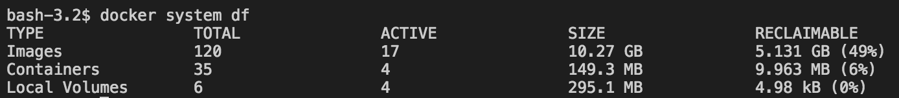

layout: true
count: false

---
class: middle, center

# What's new in Docker 1.13?

_Michael Irwin - February 8, 2017_


---

## Restructured cli

- Number of commands at top level was becoming quite large
- Effort being made to better group and organize commands

```bash
docker images -> docker image list
docker rmi    -> docker image rm
docker create -> docker container create
docker ps     -> docker container ls
```

- Use `DOCKER_HIDE_LEGACY_COMMANDS=1` to only show new command structure
- All legacy commands are still supported in 1.13. Not sure when removed yet...


---

## Experimental built-in

- Experimental builds use to be separate
- Made it hard to play with experimental features
- Now, add `--experimental` to dockerd settings
- Setting available directly from Docker for Mac/Windows GUI
- Find out if experimental is enabled using `docker system info`

```bash
> docker system info
...
Experimental: true
...
```

---

## CLI Backwards Compatibility

Ever get hit with this?

```bash
> docker ps
Error response from daemon: client is newer than server
```

- Docker for Mac/Windows are always using the latest client. Servers may not be. Commands would then cause the error.

--

- No longer an issue!
- CLI round-trips with daemon to determine version and available commands


---

## Swarm Encrypts at Rest

- Docker Swarm's RAFT database keeps data encrypted at rest with decryption keys on filesystem
- With new `--autolock` flag, user has to provide key to unlock manager

---

```bash
$ docker swarm init --autolock
Swarm initialized: current node (mh1h7vx93t1i0digtdenvqjx1) is now a manager.

To add a worker to this swarm, run the following command:

    docker swarm join \
    --token SWMTKN-1-32lrgk2aa5ubngy1u3tb85j3nh9gy1-072qmokabz6cqma5oaxi \
    172.31.10.227:2377

To add a manager to this swarm, run 'docker swarm join-token manager' and follow the instructions.

To unlock a swarm manager after it restarts, run the `docker swarm unlock`
command and provide the following key:

    SWMKEY-1-CV8QI2JwrGwpGcP9m/cQ+lteVIX12ZjvWV3ol2reNMU

Please remember to store this key in a password manager, since without it you
will not be able to restart the manager.


...

sudo shutdown -r now
docker swarm unlock < ./swarm-key
```


---

## Compose to Swarm

- New V3 Compose syntax released
  - Removes non-portable options (volume-driver, volume-from, and a few others)
  - Added Swarm options (replicas, mode, etc.)

```bash
docker stack deploy --compose-file=docker-compose-stack.yml my-app
docker stack list
docker stack rm my-app
```

---

## Sample V3 Compose file

```yml
version: '3'

services:
  app:
    image: mikesir87/cats:1.0
    ports:
      - 5000:5000
    deploy:
      replicas: 2
      update_config:
        parallelism: 1
        delay: 10s
```


---

## Data Management Commands

- New subcommands under `docker system`...
- `docker system df` will show Docker's disk usage
  
- `docker system prune` will remove all inactive images/containers/volumes
  - Inactive images have no containers based from image
  - Inactive containers are non-running containers
  - Inactive volumes are unused volumes
- Can purge groups using `docker container|image|volume prune`


---

## Secret Management

- Ability to create secrets for Swarm cluster
  ```bash
  docker secret create app-properties app.properties
  curl http://example.com/properties | docker secret create app-properties -
  ```
- Add a secret to a Swarm cluster...
  ```bash
  docker service create --secret app-properties --name=app -p 80:80 nginx
  ```
- Secrets are available in `/run/secrets/`
  - This example would have a file named `/run/secrets/app-properties`


---

## Other Orchestration Updates

- Pin image by digest
  - When running image by tag, Swarm uses digest to ensure all nodes running same version
- Service updates can now rollback, instead of continue or abort
- Added failure thresholds to rollouts


---

## Experimental features

- `docker build --squash` - produces only one layer for a build
- `docker service logs` - aggregates logs for a service across all nodes

---
class: middle, center, inverse

## That's it!