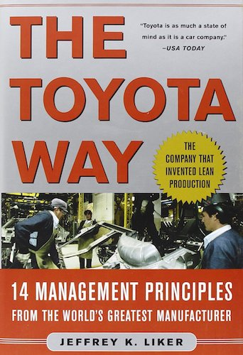
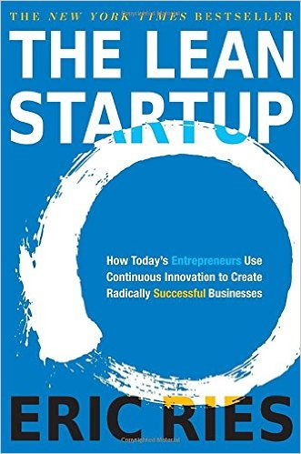
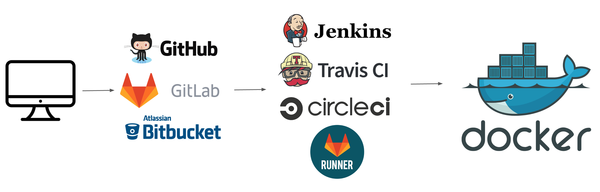

layout: true
count: false

---
class: middle, center

# Intro to CI/CD

_Michael Irwin - February 8, 2017_

---
class: center middle, inverse

## First... a history lesson!

---

## The Pareto Principal (the 80/20 rule)

- 80% of bugs are found in 20% of code
- 90% of downtime comes from 10% of defects

"80% of the errors and crashes in Windows and Office were caused by 20% of the entire pool of bugs detected."
--<cite>Microsoft's CEO, 2002</cite>

"Microsoft’s own research found that the average user of Word uses only *8%* of the functionality."
--<small><em>http://www.allaboutagile.com/agile-principle-8-enough-is-enough/</em></small>

---
class: center, middle

## How do we reduce waste?

---
class: center, middle, full-size-bg
background-image: url('images/toyota-manufacturing-plant.jpg')

---
class: center, middle, inverse

---
class: center, middle, inverse

---
class: center, middle, inverse

## How would YOU define continuous _integration_?

---

> Continuous Integration is a software development practice where members of a team integrate their work frequently, usually each person integrates at least daily - leading to multiple integrations per day. Each integration is verified by an automated build (including test) to detect integration errors as quickly as possible.
>
> -- <cite>Martin Fowler</cite>

---
class: center, middle, inverse

## How would YOU define continuous _delivery_?

---

> Continuous Delivery is a software development discipline where you build software in such a way that the software can be released to production at any time.
>
> -- <cite>Martin Fowler</cite>

---

## Recap

- Continuous...
  - **Integration** - running automated builds to test integration of application
  - **Delivery** - discipline to be able to release to production at any time
  - **Deployment** - every change goes through the pipeline and straight to production

---

## What's it look like?

- It really depends on your organization!
- A fairly typical pipeline...
  - Developer commits code locally
  - Pushes code to shared repository
  - Build server sees change (either via webhook or polling)
  - Build server performs build and runs tests
  - Artifact is created and published
  - Artifact rolled out to various tiers

---

## What tools exist?

- This is obviously not an exhaustive collection...

  

---

## Why have a pipeline?

- More reliable code
  - Tests are run automatically
  - Every stage is automated/scripted to reduce error
  - More frequent merges reduce merge issues
- Get feedback quicker
  - Did a build break? Are tests passing?
  - Are we developing the right feature?
- Morale boost
  - Engineers love seeing their work being used. Get it out faster!

---

## Getting Started

- We're going to build a pipeline that looks like this...

1. Commit code locally
2. Push to a GitHub repository
3. Docker image built automatically using Docker Cloud
4. Docker image pushed and hosted on Docker Hub

Works very well for open-source types of projects. 
I use this exact pipeline for my `mikesir87/aws-cli` image.

---
class: middle, center

## Hands-on time
https://github.com/mikesir87/ci-cd-intro-using-docker
