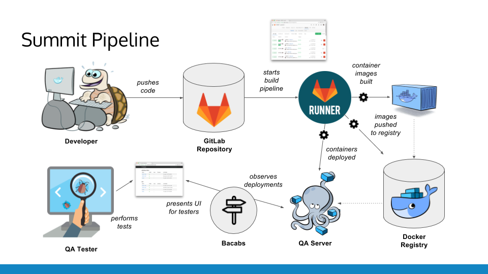
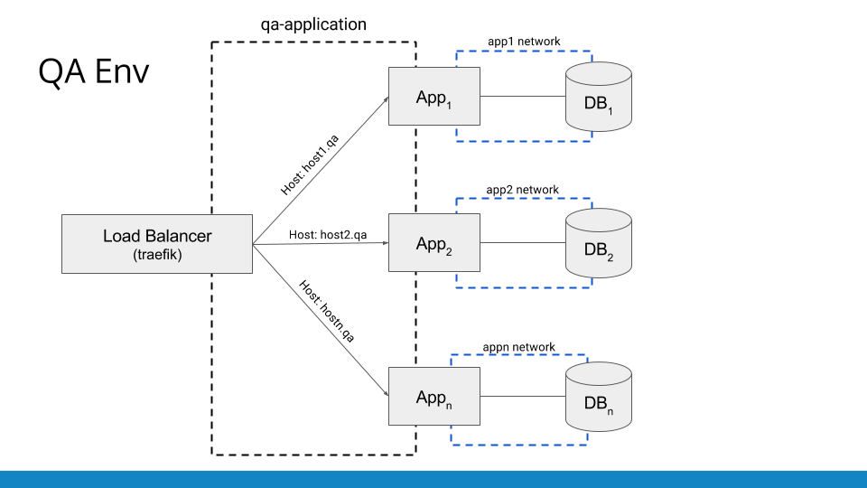
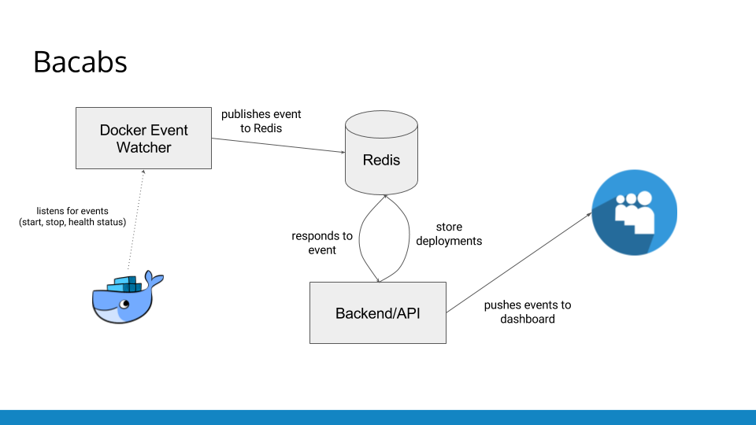

# Slides

The Summit Development pipeline (credit [Carl Harris](https://github.com/ceharris)). With every push of code...

- Code is built and tested
- Docker image is created
- Docker stack is deployed (new image plus database)
- Bacabs dashboard hears of new deployment and updates dashboard
- QA testers use dashboard to get to deployment to test




The QA environment has a load balancer/reverse proxy ([Traefik](https://traefik.io/)) that provides host-based routing. Each app service has labels that define the host, which Traefik discovers and uses in its config.

In order to get traffic, the apps need to be on the same network as Traefik. That's the `qa-application` network in the slide below. Then, each stack has its own network to allow its app (and only its app) to talk to the database container.



In order to keep things up-to-date and super responsive, everything is event driven!

- Bacabs uses a "Docker Event Watcher" component that listens for Docker events (container start/stops and health status). 
- When an event arrives, the watcher pulls out relavant details and publishes an event to Redis. 
- The backend handles the event and updates the current set of deployments
- Any updates are then pushed (via WebSocket) to each connected clients' dashboard




## Running the Demo

1. Start a Swarm (won't go into it here)
2. Set the `$HOST` variable to the hostname for your machine. All apps will be found under it (cats1.$HOST, cats2.$HOST, groceries.$HOST)
3. Deploy the Bacabs stack
```
docker stack deploy -c docker-stack-bacabs.yml bacabs
```
4. Deploy an app - cats 1.0
```
docker stack deploy -c docker-stack-cats1.yml cats-1
```
5. Deploy another version of cats!
```
docker stack deploy -c docker-stack-cats2.yml cats-2
```
6. Deploy an entirely different app stack (one with a database)
```
docker stack deploy -c docker-stack-groceries.yml groceries
```
